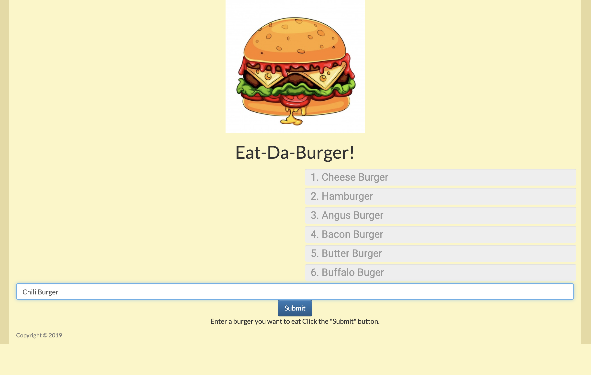
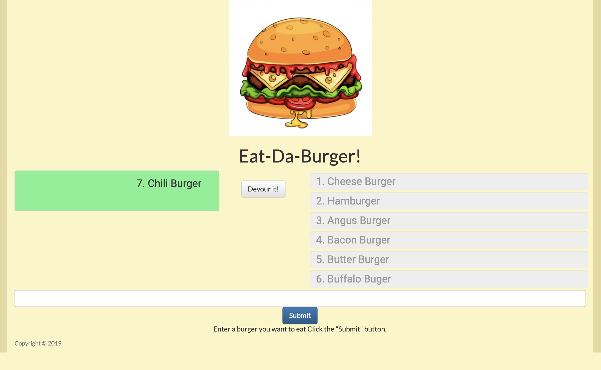
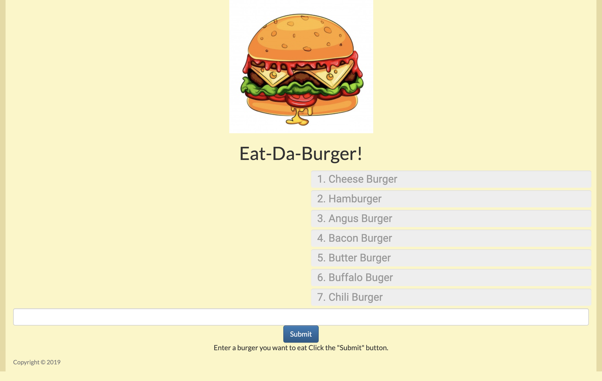

# Eat Da Burger

## Overview

In this assignment, you'll create a burger logger with MySQL, Node, Express, Handlebars and a homemade ORM (yum!). Be sure to follow the MVC design pattern; use Node and MySQL to query and route data in your app, and Handlebars to generate your HTML.

### Type in a burger you would like to eat

### Click submit to post the new burger to the page

### Then devour your burger and place it with other devoured burgers

